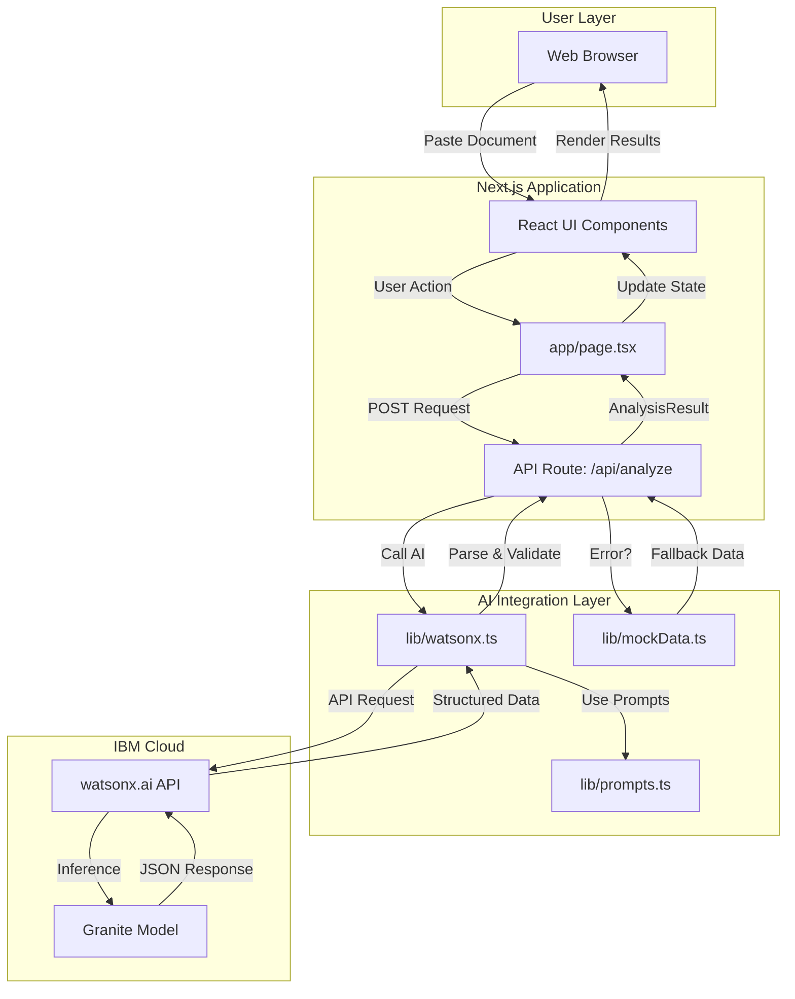
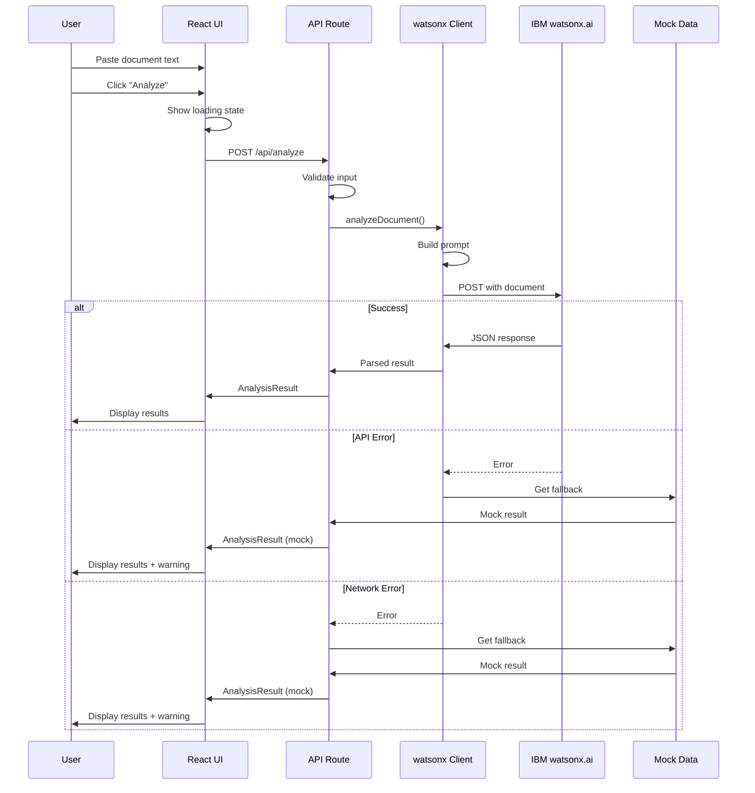
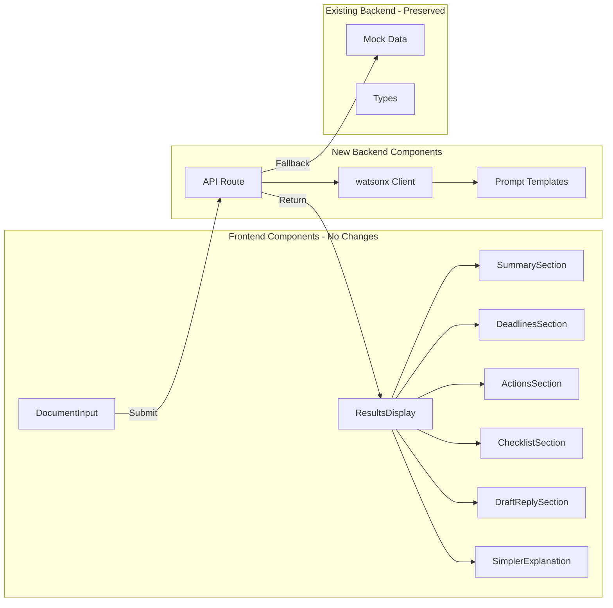
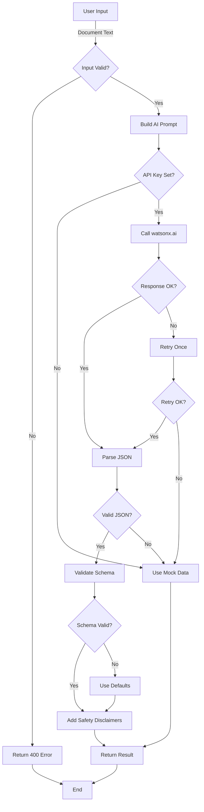
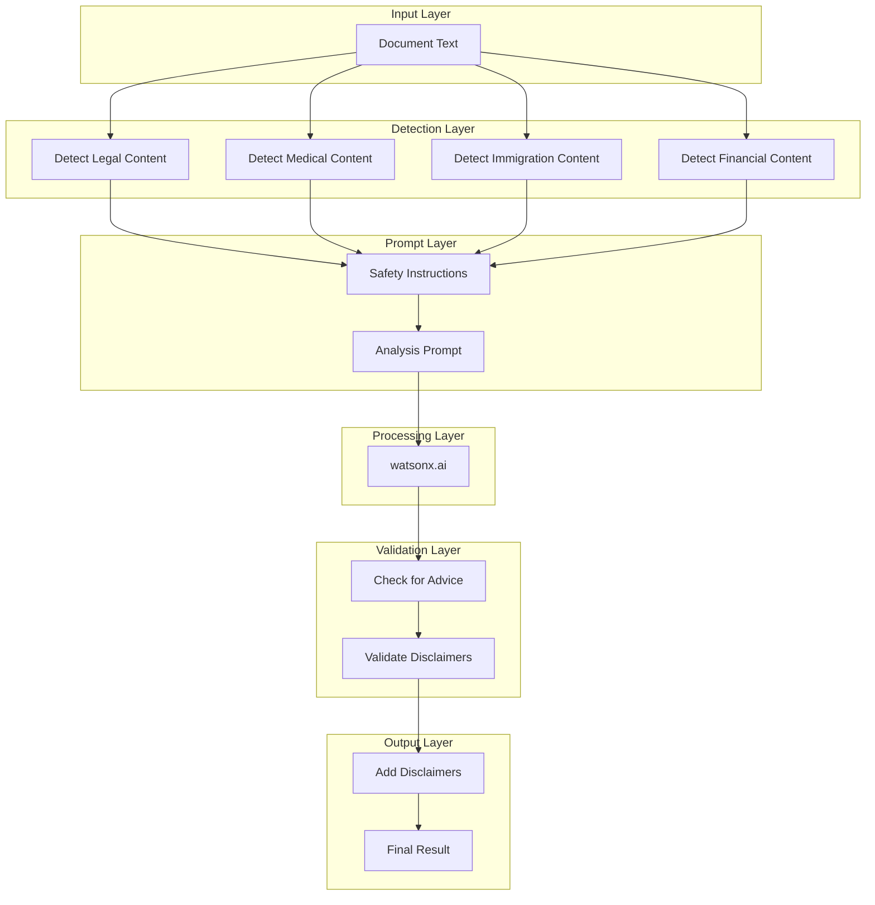
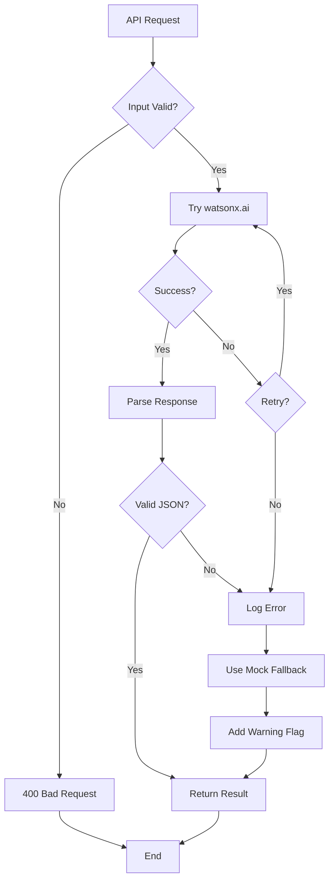
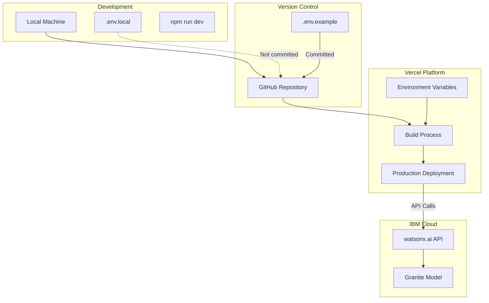
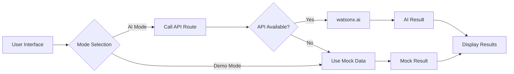
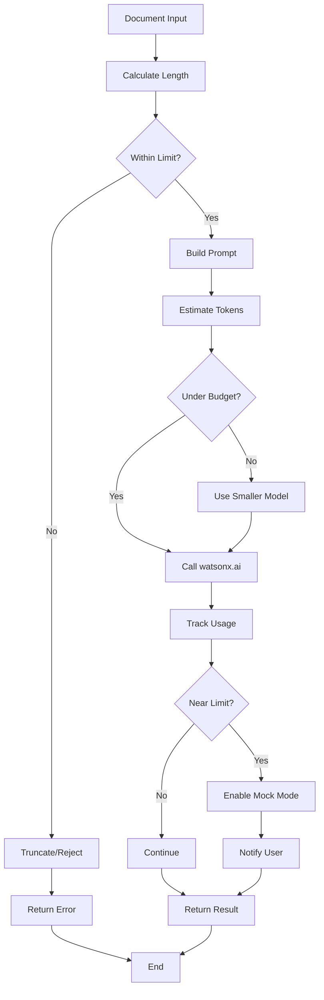

# ClearPath AI - Version 3 Architecture Diagrams

## System Architecture Overview



## Data Flow Sequence



## Component Architecture



## File Structure Changes

```
clearpath-ai/
├── app/
│   ├── page.tsx                    [MODIFIED] - API call instead of mock
│   ├── layout.tsx                  [NO CHANGE]
│   ├── globals.css                 [NO CHANGE]
│   └── api/
│       └── analyze/
│           └── route.ts            [NEW] - Main API endpoint
│
├── components/                     [NO CHANGES TO ANY COMPONENTS]
│   ├── ui/
│   ├── Header.tsx
│   ├── DocumentInput.tsx
│   ├── ResultsDisplay.tsx
│   └── [all other components]
│
├── lib/
│   ├── watsonx.ts                  [NEW] - IBM AI client
│   ├── prompts.ts                  [NEW] - Prompt templates
│   ├── mockData.ts                 [NO CHANGE] - Keep as fallback
│   ├── types.ts                    [MINOR] - Add API types
│   └── utils.ts                    [NO CHANGE]
│
├── .env.local                      [NEW] - API credentials
├── .env.example                    [NEW] - Template
└── package.json                    [OPTIONAL] - Add zod
```

## API Request/Response Flow



## Safety Layer Architecture



## Error Handling Flow



## Deployment Architecture



## Mode Toggle Architecture



## Token Flow & Cost Management



---

**Document Version**: 1.0  
**Last Updated**: 2026-06-24  
**Purpose**: Visual reference for Version 3 architecture