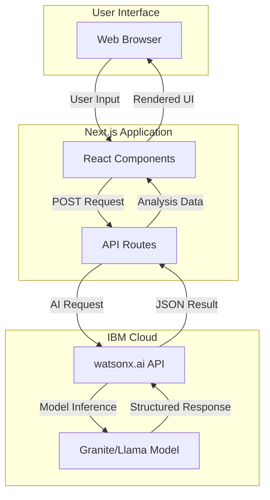

# ClearPath AI - System Architecture

## High-Level Architecture



## Component Architecture

```mermaid
graph LR
    subgraph "Frontend Components"
        A[App Page]
        B[Header]
        C[DocumentInput]
        D[ResultsDisplay]
        E[8 Result Sections]
    end
    
    subgraph "API Layer"
        F[/api/analyze]
        G[watsonx Client]
        H[Prompt Templates]
    end
    
    A --> B
    A --> C
    A --> D
    D --> E
    C -->|Submit| F
    F --> G
    F --> H
    G -->|Response| F
    F -->|Data| D
```

## Data Flow

### 1. User Input Phase
```
User pastes document text
    ↓
DocumentInput component validates
    ↓
Frontend state updated
    ↓
"Analyze" button enabled
```

### 2. Processing Phase
```
User clicks "Analyze"
    ↓
POST /api/analyze with document text
    ↓
API route receives request
    ↓
Construct structured prompt
    ↓
Call IBM watsonx.ai API
    ↓
AI model processes document
    ↓
Return structured JSON
```

### 3. Display Phase
```
API returns analysis result
    ↓
Frontend receives JSON data
    ↓
ResultsDisplay component renders
    ↓
8 sections populate with data
    ↓
User interacts with results
```

## Technology Stack Details

### Frontend Layer
- **Framework**: Next.js 14 (App Router)
- **Language**: TypeScript
- **Styling**: Tailwind CSS
- **Components**: shadcn/ui
- **Icons**: Lucide React
- **State**: React Hooks

### API Layer
- **Runtime**: Node.js (Next.js API Routes)
- **HTTP Client**: Fetch API
- **Validation**: Zod (optional)
- **Error Handling**: Try-catch with typed errors

### AI Integration
- **Provider**: IBM watsonx.ai
- **Models**: 
  - Primary: `ibm/granite-13b-chat-v2`
  - Alternative: `meta-llama/llama-3-70b-instruct`
- **Authentication**: API Key (Bearer token)
- **Endpoint**: IBM Cloud watsonx.ai REST API

### Development Tools
- **AI Assistant**: IBM Bob
- **Version Control**: Git
- **Package Manager**: npm/pnpm
- **Linting**: ESLint
- **Formatting**: Prettier

## File Structure

```
clearpath-ai/
├── app/                    # Next.js App Router
│   ├── layout.tsx         # Root layout
│   ├── page.tsx           # Main app page
│   ├── globals.css        # Global styles
│   └── api/
│       └── analyze/
│           └── route.ts   # Analysis API endpoint
│
├── components/            # React components
│   ├── ui/               # shadcn/ui primitives
│   ├── Header.tsx
│   ├── DocumentInput.tsx
│   ├── ResultsDisplay.tsx
│   └── [8 result sections]
│
├── lib/                  # Utilities
│   ├── watsonx.ts       # IBM AI client
│   ├── prompts.ts       # Prompt templates
│   └── types.ts         # TypeScript types
│
├── docs/                # Documentation
├── sample-documents/    # Test data
└── public/             # Static assets
```

## API Specification

### POST /api/analyze

**Request**:
```typescript
{
  documentText: string;      // Max 5000 characters
  simplifyLanguage?: boolean; // Optional ESL mode
}
```

**Response**:
```typescript
{
  success: boolean;
  data: {
    summary: string;
    deadlines: Deadline[];
    actions: Action[];
    documentsNeeded: string[];
    riskLevel: 'low' | 'medium' | 'high';
    riskExplanation: string;
    checklist: ChecklistItem[];
    draftReply: DraftEmail;
    simplerExplanation?: string;
  };
  processingTime: number;
}
```

## Prompt Engineering Strategy

### Structured Prompt Template

```
You are an AI assistant helping people understand confusing documents.

DOCUMENT:
{documentText}

TASK:
Analyze this document and provide a structured response in JSON format.

OUTPUT FORMAT:
{
  "summary": "2-3 sentence plain-language summary",
  "deadlines": [
    {
      "date": "YYYY-MM-DD",
      "description": "what is due",
      "daysUntil": number,
      "importance": "critical|important|normal"
    }
  ],
  "actions": [
    {
      "action": "specific action to take",
      "priority": "high|medium|low",
      "deadline": "when to do it",
      "estimatedTime": "how long it takes"
    }
  ],
  "documentsNeeded": ["list of required documents"],
  "riskLevel": "low|medium|high",
  "riskExplanation": "why this risk level",
  "checklist": [
    {
      "step": "actionable step",
      "completed": false,
      "notes": "helpful context"
    }
  ],
  "draftReply": {
    "subject": "email subject",
    "body": "professional email body",
    "tone": "formal|professional|friendly"
  },
  "simplerExplanation": "explain in simple terms for ESL users"
}

RULES:
- Be clear and direct
- Use plain language
- Identify all deadlines
- Prioritize actions
- Assess risk realistically
- Provide actionable steps
- Draft a professional reply
- No legal/medical advice
```

## Security Considerations

### API Key Management
- Store IBM API key in `.env.local`
- Never commit `.env.local` to git
- Use environment variables in production

### Input Validation
- Limit document text to 5000 characters
- Sanitize user input
- Validate JSON responses from AI

### Rate Limiting
- Implement basic rate limiting
- Cache common document types
- Handle API errors gracefully

### Data Privacy
- No data storage (stateless)
- No user authentication needed
- No personal data collection

## Performance Optimization

### Frontend
- Code splitting with Next.js
- Lazy load result sections
- Optimize images and assets
- Use React.memo for expensive components

### API
- Stream responses if possible
- Implement request timeouts
- Cache prompt templates
- Minimize API payload size

### AI Integration
- Optimize prompt length
- Use appropriate model size
- Implement retry logic
- Handle timeouts gracefully

## Error Handling Strategy

### Frontend Errors
- Network failures → Show retry button
- Invalid input → Inline validation messages
- API errors → User-friendly error display

### API Errors
- IBM API down → Return cached sample response
- Rate limit exceeded → Queue request or show message
- Invalid response → Log error, return fallback

### AI Response Errors
- Malformed JSON → Parse with fallback
- Missing fields → Use default values
- Unexpected format → Log and retry

## Deployment Strategy

### Development
- Local development with `npm run dev`
- Use `.env.local` for API keys
- Test with sample documents

### Production
- Deploy to Vercel (recommended)
- Set environment variables in Vercel dashboard
- Enable analytics and monitoring
- Use production IBM API endpoint

### Demo Environment
- Pre-load sample documents
- Cache sample responses as fallback
- Ensure fast load times
- Test on multiple devices

## Monitoring & Analytics

### Key Metrics
- API response time
- Success/error rate
- Document types analyzed
- User engagement (time on page)

### Logging
- API request/response logs
- Error tracking
- Performance metrics
- User feedback (optional)

## Future Enhancements (Post-MVP)

### Phase 2 Features
- Multi-language support
- Document upload (PDF, images)
- Save/export results
- Email integration
- Mobile app

### Phase 3 Features
- User accounts
- Document history
- Collaboration features
- Advanced analytics
- Custom templates

## IBM Bob Integration Points

Bob will assist with:
1. **Project setup** - Initialize Next.js, install dependencies
2. **Component creation** - Generate React components
3. **API development** - Build API routes and watsonx integration
4. **Prompt engineering** - Refine AI prompts
5. **Styling** - Implement Tailwind CSS
6. **Testing** - Create test cases and sample documents
7. **Documentation** - Generate code comments and docs
8. **Debugging** - Fix issues and optimize code

All Bob interactions will be logged in [`docs/ai-usage-log.md`](docs/ai-usage-log.md).

---

**Architecture Version**: 1.0  
**Last Updated**: 2026-06-24  
**Status**: Planning Phase