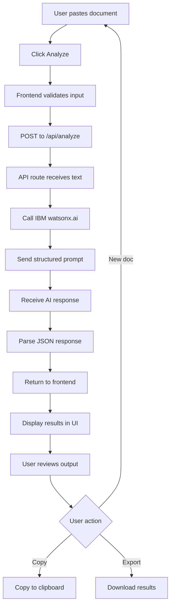

# ClearPath AI - Implementation Plan

## Project Overview
**Challenge**: IBM AI Builders Challenge - July Wildcard Challenge  
**Tool**: IBM Bob (AI-powered development assistant)  
**Timeline**: MVP for 3-minute demo  
**Target Users**: Newcomers, international students, first-generation students, people struggling with confusing documents

---

## 1. Recommended Tech Stack

### Frontend
- **Framework**: Next.js 14 (App Router)
  - Server-side rendering for better performance
  - Built-in API routes
  - Easy deployment to Vercel
  - Excellent developer experience

### Styling
- **Tailwind CSS**: Rapid UI development with utility classes
- **shadcn/ui**: Pre-built accessible components
- **Lucide React**: Clean, modern icons

### AI Integration
- **IBM watsonx.ai**: Primary AI service (required for challenge)
  - Model: `ibm/granite-13b-chat-v2` or `meta-llama/llama-3-70b-instruct`
  - API endpoint via IBM Cloud
- **Fallback**: OpenAI GPT-4 for development/testing if needed

### State Management
- **React Hooks**: useState, useEffect (sufficient for MVP)
- No complex state management needed

### Development Tools
- **TypeScript**: Type safety and better developer experience
- **ESLint + Prettier**: Code quality and formatting
- **IBM Bob**: Primary development assistant (document all usage)

---

## 2. Folder Structure

```
clearpath-ai/
├── app/                          # Next.js App Router
│   ├── layout.tsx               # Root layout with metadata
│   ├── page.tsx                 # Home page (main app)
│   ├── globals.css              # Global styles + Tailwind
│   └── api/
│       └── analyze/
│           └── route.ts         # POST endpoint for document analysis
├── components/
│   ├── ui/                      # shadcn/ui components
│   │   ├── button.tsx
│   │   ├── card.tsx
│   │   ├── textarea.tsx
│   │   ├── badge.tsx
│   │   └── alert.tsx
│   ├── Header.tsx               # App header with branding
│   ├── DocumentInput.tsx        # Text input area + submit
│   ├── ResultsDisplay.tsx       # Main results container
│   ├── SummarySection.tsx       # Plain-language summary
│   ├── DeadlinesSection.tsx     # Important deadlines
│   ├── ActionsSection.tsx       # Required actions
│   ├── DocumentsSection.tsx     # Documents needed
│   ├── RiskBadge.tsx           # Risk level indicator
│   ├── ChecklistSection.tsx     # Step-by-step checklist
│   ├── DraftReplySection.tsx    # Draft email reply
│   ├── SimplerExplanation.tsx   # ESL/low-literacy version
│   └── LoadingState.tsx         # Loading animation
├── lib/
│   ├── watsonx.ts              # IBM watsonx.ai client
│   ├── prompts.ts              # AI prompt templates
│   └── types.ts                # TypeScript interfaces
├── docs/
│   ├── architecture.md         # System architecture
│   ├── problem-statement.md    # Problem definition
│   ├── judging-strategy.md     # How we address judging criteria
│   ├── demo-script.md          # 3-minute demo walkthrough
│   ├── ai-usage-log.md         # IBM Bob usage documentation
│   └── implementation-plan.md  # This file
├── sample-documents/
│   ├── sample-appointment-letter.txt
│   ├── sample-housing-notice.txt
│   └── sample-school-email.txt
├── public/
│   └── images/                 # Logo, screenshots
├── .env.local                  # API keys (gitignored)
├── .gitignore
├── package.json
├── tsconfig.json
├── tailwind.config.ts
├── next.config.js
└── README.md
```

---

## 3. Main Screens/Components

### Single-Page Application Layout

```
┌─────────────────────────────────────────────┐
│  Header (Logo + Title + IBM Badge)          │
├─────────────────────────────────────────────┤
│                                             │
│  [Left Panel - Input]                       │
│  ┌───────────────────────────┐             │
│  │ Paste your document here  │             │
│  │                           │             │
│  │ [Large textarea]          │             │
│  │                           │             │
│  └───────────────────────────┘             │
│  [Analyze Document Button]                  │
│                                             │
├─────────────────────────────────────────────┤
│                                             │
│  [Right Panel - Results]                    │
│  ┌───────────────────────────┐             │
│  │ 📋 Summary                │             │
│  │ ⏰ Deadlines              │             │
│  │ ✅ Actions                │             │
│  │ 📄 Documents Needed       │             │
│  │ ⚠️  Risk Level            │             │
│  │ ☑️  Checklist             │             │
│  │ ✉️  Draft Reply           │             │
│  │ 🌐 Simpler Explanation    │             │
│  └───────────────────────────┘             │
│                                             │
└─────────────────────────────────────────────┘
```

### Component Breakdown

1. **Header.tsx**
   - ClearPath AI logo/title
   - IBM watsonx.ai badge
   - Brief tagline

2. **DocumentInput.tsx**
   - Large textarea for document text
   - Character counter
   - "Analyze Document" button
   - Sample document quick-load buttons

3. **ResultsDisplay.tsx**
   - Container for all result sections
   - Conditional rendering (show after analysis)
   - Print/export functionality

4. **Individual Result Sections** (8 components)
   - Each section is a card with icon + content
   - Collapsible for better UX
   - Copy-to-clipboard functionality

---

## 4. API/Data Flow

### Flow Diagram



### API Endpoint Details

**Endpoint**: `POST /api/analyze`

**Request Body**:
```json
{
  "documentText": "string (max 5000 chars)",
  "simplifyLanguage": "boolean (optional)"
}
```

**Response**:
```json
{
  "success": true,
  "data": {
    "summary": "string",
    "deadlines": [
      {
        "date": "YYYY-MM-DD",
        "description": "string",
        "daysUntil": "number"
      }
    ],
    "actions": [
      {
        "action": "string",
        "priority": "high|medium|low",
        "deadline": "string (optional)"
      }
    ],
    "documentsNeeded": ["string"],
    "riskLevel": "low|medium|high",
    "riskExplanation": "string",
    "checklist": [
      {
        "step": "string",
        "completed": false
      }
    ],
    "draftReply": {
      "subject": "string",
      "body": "string"
    },
    "simplerExplanation": "string (optional)"
  },
  "processingTime": "number (ms)"
}
```

**Error Response**:
```json
{
  "success": false,
  "error": "string",
  "message": "string"
}
```

---

## 5. AI Output JSON Structure

### Detailed Schema

```typescript
interface AnalysisResult {
  // 1. Plain-language summary
  summary: string;
  
  // 2. Important deadlines
  deadlines: Deadline[];
  
  // 3. Required actions
  actions: Action[];
  
  // 4. Documents/items needed
  documentsNeeded: string[];
  
  // 5. Risk level
  riskLevel: 'low' | 'medium' | 'high';
  riskExplanation: string;
  
  // 6. Step-by-step checklist
  checklist: ChecklistItem[];
  
  // 7. Draft reply email
  draftReply: DraftEmail;
  
  // 8. Simpler explanation (optional)
  simplerExplanation?: string;
}

interface Deadline {
  date: string;           // ISO 8601 format
  description: string;
  daysUntil: number;      // Calculated from today
  importance: 'critical' | 'important' | 'normal';
}

interface Action {
  action: string;
  priority: 'high' | 'medium' | 'low';
  deadline?: string;
  estimatedTime?: string; // e.g., "15 minutes", "1 hour"
}

interface ChecklistItem {
  step: string;
  completed: boolean;
  notes?: string;
}

interface DraftEmail {
  subject: string;
  body: string;
  tone: 'formal' | 'professional' | 'friendly';
}
```

---

## 6. Step-by-Step Build Order

### Phase 1: Project Setup (30 minutes)
1. Initialize Next.js project with TypeScript
2. Install dependencies (Tailwind, shadcn/ui, IBM SDK)
3. Set up environment variables
4. Configure Tailwind and globals.css
5. Create basic folder structure

### Phase 2: IBM watsonx.ai Integration (45 minutes)
6. Set up IBM Cloud account and get API credentials
7. Create [`lib/watsonx.ts`](lib/watsonx.ts) client
8. Create [`lib/prompts.ts`](lib/prompts.ts) with structured prompt template
9. Test API connection with simple request
10. Create [`app/api/analyze/route.ts`](app/api/analyze/route.ts)

### Phase 3: Core UI Components (1 hour)
11. Install shadcn/ui components (button, card, textarea, badge, alert)
12. Create [`components/Header.tsx`](components/Header.tsx)
13. Create [`components/DocumentInput.tsx`](components/DocumentInput.tsx)
14. Create [`components/LoadingState.tsx`](components/LoadingState.tsx)
15. Build basic layout in [`app/page.tsx`](app/page.tsx)

### Phase 4: Results Display (1.5 hours)
16. Create [`components/ResultsDisplay.tsx`](components/ResultsDisplay.tsx) container
17. Build 8 individual section components:
    - [`components/SummarySection.tsx`](components/SummarySection.tsx)
    - [`components/DeadlinesSection.tsx`](components/DeadlinesSection.tsx)
    - [`components/ActionsSection.tsx`](components/ActionsSection.tsx)
    - [`components/DocumentsSection.tsx`](components/DocumentsSection.tsx)
    - [`components/RiskBadge.tsx`](components/RiskBadge.tsx)
    - [`components/ChecklistSection.tsx`](components/ChecklistSection.tsx)
    - [`components/DraftReplySection.tsx`](components/DraftReplySection.tsx)
    - [`components/SimplerExplanation.tsx`](components/SimplerExplanation.tsx)

### Phase 5: Integration & Testing (1 hour)
18. Connect frontend to API endpoint
19. Add error handling and loading states
20. Create 3 sample documents
21. Test with each sample document
22. Fix bugs and refine UI

### Phase 6: Polish & Documentation (45 minutes)
23. Add responsive design improvements
24. Implement copy-to-clipboard functionality
25. Add print/export feature
26. Write [`docs/architecture.md`](docs/architecture.md)
27. Write [`docs/demo-script.md`](docs/demo-script.md)
28. Update [`docs/ai-usage-log.md`](docs/ai-usage-log.md)

### Phase 7: Demo Preparation (30 minutes)
29. Create demo video script
30. Prepare 3-minute walkthrough
31. Test demo flow multiple times
32. Create screenshots for submission

**Total Estimated Time**: 5-6 hours

---

## 7. Files to Create First (Priority Order)

### Immediate Priority (Foundation)
1. **`package.json`** - Dependencies and scripts
2. **`.env.local`** - API keys (IBM watsonx.ai)
3. **`lib/types.ts`** - TypeScript interfaces
4. **`lib/watsonx.ts`** - IBM AI client
5. **`lib/prompts.ts`** - AI prompt templates

### High Priority (Core Functionality)
6. **`app/api/analyze/route.ts`** - API endpoint
7. **`app/layout.tsx`** - Root layout
8. **`app/page.tsx`** - Main application page
9. **`components/Header.tsx`** - App header
10. **`components/DocumentInput.tsx`** - Input component

### Medium Priority (Results Display)
11. **`components/ResultsDisplay.tsx`** - Results container
12. **`components/SummarySection.tsx`** - Summary display
13. **`components/DeadlinesSection.tsx`** - Deadlines display
14. **`components/ActionsSection.tsx`** - Actions display
15. **`components/RiskBadge.tsx`** - Risk indicator

### Lower Priority (Enhancement)
16. **`components/ChecklistSection.tsx`** - Checklist display
17. **`components/DraftReplySection.tsx`** - Email draft
18. **`components/SimplerExplanation.tsx`** - ESL version
19. **`components/LoadingState.tsx`** - Loading animation

### Documentation (Parallel Work)
20. **`sample-documents/*.txt`** - Test documents
21. **`docs/architecture.md`** - System design
22. **`docs/demo-script.md`** - Demo walkthrough
23. **`docs/ai-usage-log.md`** - IBM Bob documentation

---

## 8. IBM Bob Documentation Strategy

### What to Document
We will maintain a detailed log in [`docs/ai-usage-log.md`](docs/ai-usage-log.md) that includes:

1. **Every Bob interaction**
   - Date and time
   - Task requested
   - Bob's approach/solution
   - Code generated
   - Iterations needed

2. **Development decisions**
   - Why we chose specific approaches
   - How Bob helped solve problems
   - Alternative solutions Bob suggested

3. **Code quality metrics**
   - Lines of code generated by Bob
   - Manual modifications needed
   - Bug fixes assisted by Bob

4. **Time savings**
   - Estimated time without Bob
   - Actual time with Bob
   - Productivity multiplier

### Documentation Format

```markdown
## [Date] - [Task Name]

**Objective**: Brief description of what we asked Bob to do

**Bob's Approach**: How Bob tackled the problem

**Code Generated**: 
- File: path/to/file.ts
- Lines: 50
- Quality: Excellent/Good/Needs refinement

**Iterations**: Number of back-and-forth exchanges

**Outcome**: Success/Partial/Needs manual work

**Time Saved**: Estimated X hours

**Notes**: Any interesting insights or learnings
```

### Showcase Bob's Value
- Highlight complex problems Bob solved
- Show before/after code comparisons
- Document debugging assistance
- Capture architectural decisions Bob helped with
- Include Bob's suggestions that improved the project

---

## 9. Judging Criteria Alignment

### Technical Execution
- **Clean, well-structured code**: TypeScript + Next.js best practices
- **Proper error handling**: Graceful failures, user-friendly messages
- **Performance**: Fast API responses, optimized rendering
- **IBM watsonx.ai integration**: Proper use of IBM's AI platform

### Innovation
- **Unique approach**: Document-to-action transformation
- **8-part structured output**: Comprehensive analysis
- **Risk assessment**: Automated priority detection
- **Draft reply generation**: Saves time and reduces anxiety

### Challenge Fit (Wildcard - Future of Work)
- **Addresses real workplace challenge**: Document comprehension
- **Helps underserved populations**: Newcomers, students, ESL users
- **Reduces barriers**: Makes official communication accessible
- **Practical application**: Immediate real-world use

### Feasibility
- **MVP in 5-6 hours**: Realistic timeline
- **No complex infrastructure**: Simple deployment
- **No authentication needed**: Focus on core functionality
- **Easy to demo**: 3-minute walkthrough

### Real-World Impact
- **Reduces stress**: Clear action items and deadlines
- **Prevents missed opportunities**: Deadline tracking
- **Improves communication**: Draft reply assistance
- **Inclusive design**: Simpler explanation for ESL users

---

## 10. Risk Mitigation

### Technical Risks
- **IBM API rate limits**: Implement caching, use sample responses for demo
- **API latency**: Show loading states, set reasonable timeouts
- **Prompt engineering**: Test with diverse documents, refine prompts

### Scope Risks
- **Feature creep**: Stick to 8 core outputs, no extras
- **Over-engineering**: Keep it simple, no unnecessary abstractions
- **Time management**: Follow build order strictly

### Demo Risks
- **Live API failure**: Have pre-recorded backup demo
- **Network issues**: Cache sample results locally
- **Time overrun**: Practice 3-minute demo multiple times

---

## 11. Success Metrics

### For MVP
- ✅ Analyzes documents in < 10 seconds
- ✅ Produces all 8 output sections
- ✅ Works with 3+ document types
- ✅ Mobile-responsive design
- ✅ Clear, beginner-friendly UI
- ✅ 3-minute demo ready

### For Judging
- ✅ Demonstrates IBM watsonx.ai integration
- ✅ Shows real-world impact
- ✅ Highlights Bob's contribution
- ✅ Clean, documented code
- ✅ Addresses challenge criteria

---

## Next Steps

1. **Review this plan** - Confirm approach and priorities
2. **Set up development environment** - Install tools, get API keys
3. **Start with Phase 1** - Initialize project structure
4. **Document Bob usage** - Log every interaction
5. **Build iteratively** - Test after each phase
6. **Prepare demo** - Practice walkthrough

**Ready to start building?** Let me know if you'd like to proceed with implementation or if you want to adjust any part of this plan.